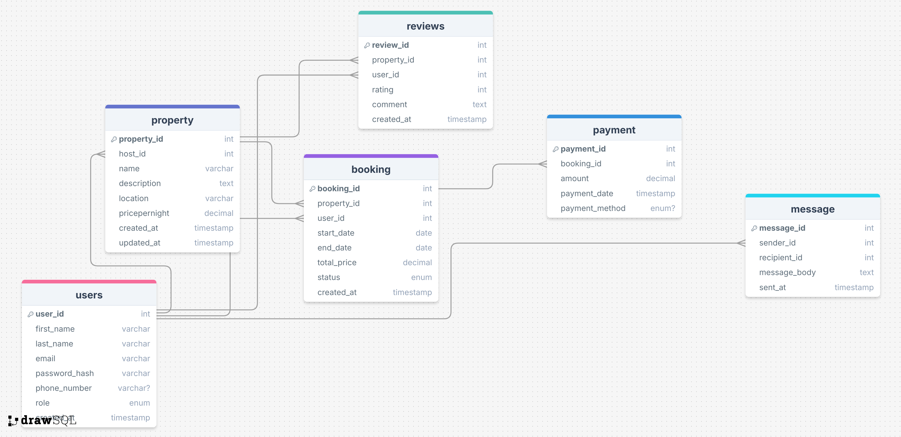

# 📘 Entity Relationship Diagram (ERD) - Property Booking Platform

## 🧩 Entities and Attributes

### 1. **User**
- `user_id`: UUID, Primary Key, Indexed
- `first_name`: VARCHAR, NOT NULL
- `last_name`: VARCHAR, NOT NULL
- `email`: VARCHAR, UNIQUE, NOT NULL
- `password_hash`: VARCHAR, NOT NULL
- `phone_number`: VARCHAR, NULL
- `role`: ENUM (guest, host, admin), NOT NULL
- `created_at`: TIMESTAMP, DEFAULT CURRENT_TIMESTAMP

### 2. **Property**
- `property_id`: UUID, Primary Key, Indexed
- `host_id`: UUID, Foreign Key → User(user_id)
- `name`: VARCHAR, NOT NULL
- `description`: TEXT, NOT NULL
- `location`: VARCHAR, NOT NULL
- `pricepernight`: DECIMAL, NOT NULL
- `created_at`: TIMESTAMP, DEFAULT CURRENT_TIMESTAMP
- `updated_at`: TIMESTAMP, ON UPDATE CURRENT_TIMESTAMP

### 3. **Booking**
- `booking_id`: UUID, Primary Key, Indexed
- `property_id`: UUID, Foreign Key → Property(property_id)
- `user_id`: UUID, Foreign Key → User(user_id)
- `start_date`: DATE, NOT NULL
- `end_date`: DATE, NOT NULL
- `total_price`: DECIMAL, NOT NULL
- `status`: ENUM (pending, confirmed, canceled), NOT NULL
- `created_at`: TIMESTAMP, DEFAULT CURRENT_TIMESTAMP

### 4. **Payment**
- `payment_id`: UUID, Primary Key, Indexed
- `booking_id`: UUID, Foreign Key → Booking(booking_id)
- `amount`: DECIMAL, NOT NULL
- `payment_date`: TIMESTAMP, DEFAULT CURRENT_TIMESTAMP
- `payment_method`: ENUM (credit_card, paypal, stripe), NOT NULL

### 5. **Review**
- `review_id`: UUID, Primary Key, Indexed
- `property_id`: UUID, Foreign Key → Property(property_id)
- `user_id`: UUID, Foreign Key → User(user_id)
- `rating`: INTEGER (1 to 5), NOT NULL
- `comment`: TEXT, NOT NULL
- `created_at`: TIMESTAMP, DEFAULT CURRENT_TIMESTAMP

### 6. **Message**
- `message_id`: UUID, Primary Key, Indexed
- `sender_id`: UUID, Foreign Key → User(user_id)
- `recipient_id`: UUID, Foreign Key → User(user_id)
- `message_body`: TEXT, NOT NULL
- `sent_at`: TIMESTAMP, DEFAULT CURRENT_TIMESTAMP

---

## 🔗 Relationships Between Entities

| Entity 1   | Relationship Type | Entity 2   | Description |
|------------|-------------------|------------|-------------|
| User       | 1 ⟶ N             | Property   | A host can own multiple properties |
| User       | 1 ⟶ N             | Booking    | A user can make multiple bookings |
| Property   | 1 ⟶ N             | Booking    | A property can have many bookings |
| Booking    | 1 ⟶ 1             | Payment    | Each booking has one payment |
| User       | 1 ⟶ N             | Review     | A user can write multiple reviews |
| Property   | 1 ⟶ N             | Review     | A property can have many reviews |
| User       | 1 ⟶ N             | Message    | Users can send or receive messages |

---

## ✅ Indexing and Constraints

- **Primary Keys**: Automatically indexed.
- **Indexed Columns**:
  - `email` in `User`
  - `property_id` in `Property` and `Booking`
  - `booking_id` in `Booking` and `Payment`

- **Constraints**:
  - Unique constraint on `User.email`
  - ENUM constraints on `User.role`, `Booking.status`, and `Payment.payment_method`
  - CHECK constraint on `Review.rating` (1–5)
  - Foreign key constraints to maintain referential integrity

---

## 🗺️ ER Diagram

Below is the visual representation of the database structure:

